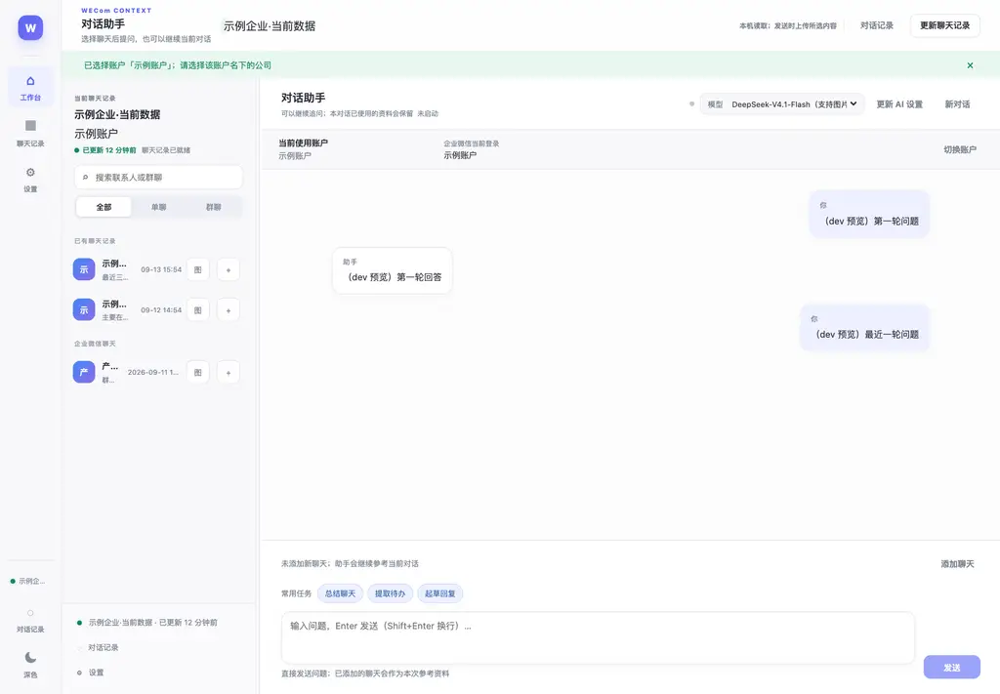
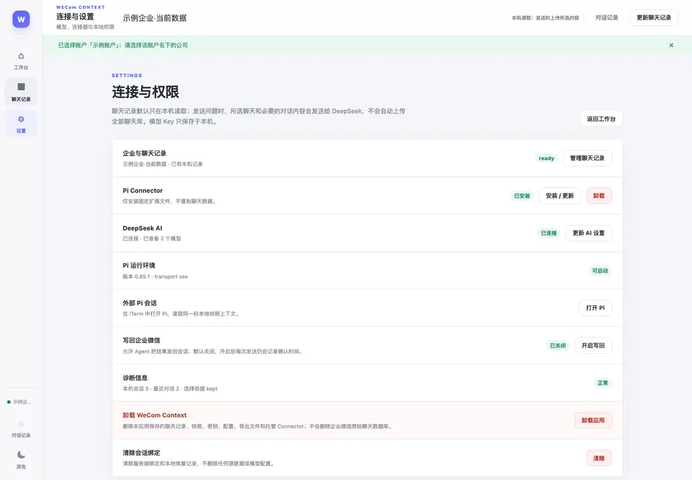
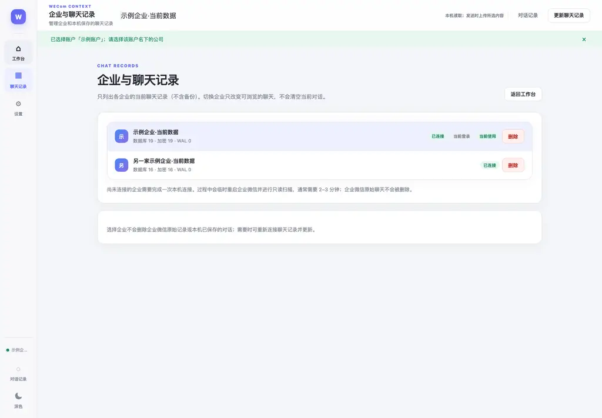
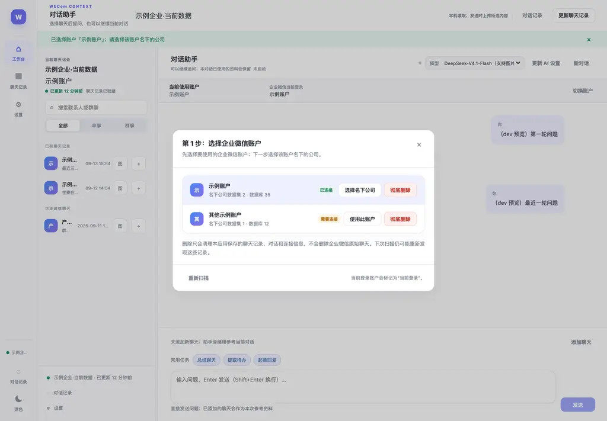
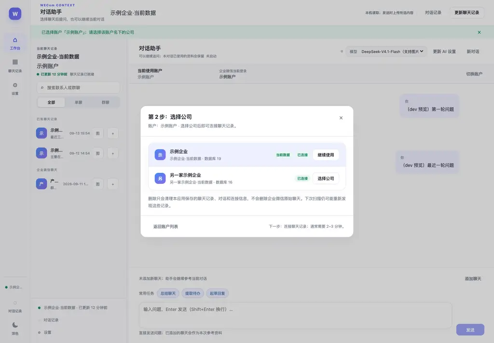
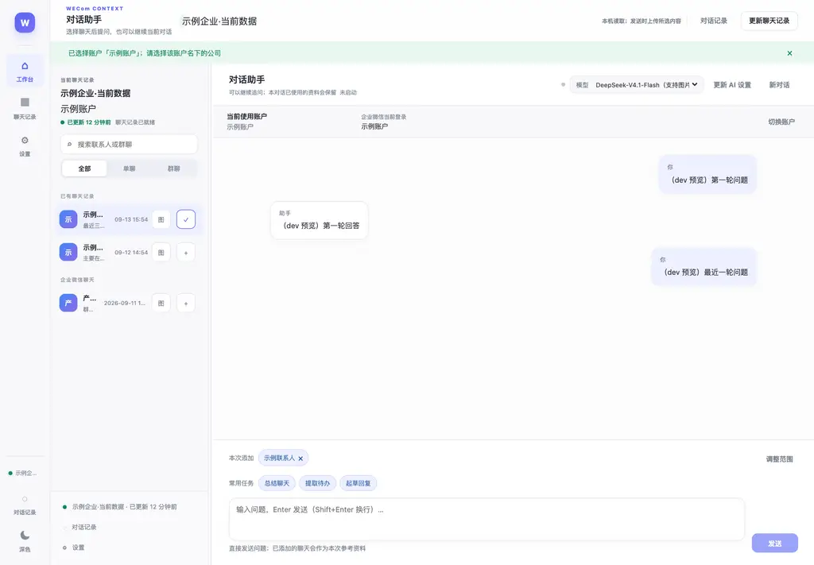

# WeCom Context

面向 macOS 的企业微信本地上下文 Agent 应用。WeCom Context 从企业微信本地数据中构建经过身份校验的文本与图片上下文，用户明确选择会话后，再将上下文发送给 Pi Agent，用于私有资料问答、总结、待办提取和回复草稿。

> 当前社区版面向 Apple Silicon macOS。项目不部署网络服务器，也不会自动读取或自动注入企业微信内容。

## 核心能力

- Tauri 2 + Rust 桌面应用。
- Python Sidecar 负责本地数据解析、快照、上下文准备和图片处理。
- Pi RPC Agent 持久会话与上下文注入。
- 企业账户、公司数据集、快照和会话的多级身份校验。
- 按会话选择上下文，支持单聊、群聊、搜索和筛选。
- 支持文本与图片上下文；图片下载带缓存、大小和 MD5 校验。
- Pi Connector：在 Pi 中读取企业微信上下文。
- 本地保存 API 配置和会话状态，不把企业微信数据上传到项目服务器。

## 使用流程

### 1. 启动应用并确认数据源

首次使用时，先确认企业微信已经登录目标账户，并且目标公司数据已经在本机可用。应用顶部会显示当前账户和公司数据集；点击顶部数据集按钮可以重新选择。

必须先核对：

1. 当前企业微信登录账户与目标数据集属于同一账户；
2. 目标公司是需要分析的公司，而不是同账户下的其他公司或备份数据；
3. 只选择有权访问的企业和会话。



### 2. 配置 AI 连接

进入左侧「设置」，在「DeepSeek AI」区域点击「更新 AI 设置」，填写可用的 API 配置。API Key 只应保存到本机配置中，不要放入仓库、截图、日志或 Issue。

设置页同时提供以下管理入口：

- **企业与聊天记录**：管理已经发现的数据集，并更新本地聊天记录快照；
- **Pi Connector**：安装或更新 Pi Connector；
- **Pi 运行环境**：查看本地 Pi Runtime 是否可启动；
- **外部 Pi 会话**：从终端打开 Pi，并读取当前上下文；
- **写回企业微信**：显式开启后，才允许 Agent 请求发送或写回企业微信；
- **诊断信息**：查看版本、连接和会话状态；
- **卸载应用 / 清除会话绑定**：删除应用组件或本地绑定配置前，请先确认影响范围。



### 3. 管理企业与聊天记录

左侧「聊天记录」用于管理本地快照，不直接修改企业微信服务器上的内容。页面会列出已发现的公司数据集、数据库规模、连接状态和当前使用的数据集。

点击「更新聊天记录」后，Sidecar 会重新读取并校验本地数据。数据量较大时可能需要等待数分钟；更新期间不要退出企业微信或删除其本地数据目录。



### 4. 选择账户，再选择公司

WeCom Context 将「企业微信登录账户」和「账户下的公司数据集」分成两步选择，避免把同一账户下的多个公司混在一起。

点击工作台顶部的数据集按钮：

1. 在第 1 步选择企业微信账户；
2. 点击「选择名下公司」进入第 2 步；
3. 选择目标公司数据集；
4. 等待聊天记录连接完成后返回工作台。





连接前后都要再次核对账户和公司名称。切换数据集不会自动把其他公司的聊天记录带入当前提问。

### 5. 选择聊天上下文

回到「工作台」后，可以：

- 用搜索框按联系人或群名称筛选；
- 使用「全部 / 单聊 / 群聊」过滤列表；
- 点击会话右侧的「+」或「添加到本次提问」，把会话加入当前问题；
- 点击图片按钮，导出该会话中可用的图片；缺失图片会尝试由企业微信客户端补齐；
- 使用「调整范围」查看或修改本次问题已经选择的上下文。

应用只会把明确加入本次提问的会话作为上下文，不会因为打开工作台就自动把全部聊天发送给模型。



### 6. 提问、总结和生成草稿

在底部输入框填写问题并点击「发送」，或按 Enter 发送；需要换行时使用 Shift+Enter。发送前可以从模型下拉框选择已配置的模型。

工作台提供三个常用快捷操作：

- **总结聊天**：对当前已选择的会话生成摘要；
- **提取待办**：从上下文中提取任务、负责人和截止时间等信息；
- **起草回复**：根据上下文生成回复草稿，发送前由用户检查和修改。

快捷操作仍然遵循当前的会话选择范围。模型回复只代表模型输出，不应替代用户对企业信息、权限和发送对象的最终确认。

### 7. 图片上下文和 macOS 权限

图片处理分为本地缓存查找和企业微信客户端补图两部分。若图片不在本地缓存，应用可能需要控制企业微信打开对应会话并等待客户端生成缓存。

首次使用图片补齐前，按 macOS「隐私与安全性」中的提示授予必要权限：

- **辅助功能**：允许 WeCom Context 控制企业微信窗口；
- **自动化**：允许 WeCom Context 通过 System Events 操作企业微信；
- **完全磁盘访问权限**：仅在系统限制导致无法读取企业微信本地容器时按需配置。

不同 macOS 版本、企业微信版本和本地缓存状态可能导致图片补齐失败。应用会返回结构化错误和尝试次数；失败时可先手动打开、滚动目标会话，再回到应用重试。不要为了绕过权限错误而上传企业微信数据库或密钥。

### 8. Pi Connector

安装 Pi Connector 后，可以在 Pi 中使用项目提供的企业微信上下文能力。Connector 仍然通过本地 Sidecar 读取和准备数据；它不会绕过桌面端的账户、数据集和会话选择逻辑。

建议先在桌面端完成以下步骤，再在 Pi 中调用：

1. 选择正确的账户和公司数据集；
2. 更新聊天记录快照；
3. 明确选择需要引用的会话；
4. 检查上下文范围和敏感信息；
5. 再让 Pi 生成答案或执行后续动作。

## 隐私与安全边界

本项目处理的是用户本机企业微信数据。使用和发布前必须确认：

1. 当前企业微信登录账户与目标数据集一致；
2. 仅选择明确授权的企业、公司和会话；
3. 不将 `keys/`、`snapshots/`、`exports/`、聊天记录、图片或企业微信数据库上传到 GitHub；
4. 不在配置文件、日志、截图和 Issue 中发布 API Key、数据库密钥、联系人信息或消息内容；
5. 了解 macOS 辅助功能、自动化和完全磁盘访问权限的影响；
6. 开启写回前确认 Agent 的目标会话、消息内容和账号权限。

本 README 中的截图来自脱敏的开发预览，画面中的账户、公司、联系人和消息均为示例数据，不代表用户本机数据。实际使用时界面内容会随本地账户和快照变化。

## 项目结构

```text
apps/desktop/       Tauri 前端和 Rust 后端
packages/           Pi Connector 源码
sidecar/            Python 数据处理层和测试
contracts/          IPC 与 Sidecar JSON Schema 契约
scripts/            构建、资源暂存和发布脚本
phase2/             Sidecar 辅助模块
third_party/        第三方依赖源码与许可声明
docs/               离线安装说明和界面截图
```

## 开发环境

当前发布流程面向 Apple Silicon macOS，要求：

- macOS arm64；
- Node.js >= 22.19.0；
- Python 3.13；
- Bun 或 npm；
- Rust、Tauri CLI；
- 已安装并可调用的 Pi Coding Agent；
- 如需取钥和客户端图片处理，需要企业微信及对应 macOS 权限。

## 本地检查

```bash
npm install
npm run check
python3 contracts/validate_contracts.py
```

Sidecar 测试需要先创建并安装项目约定的 Python 虚拟环境：

```bash
python3 -m venv sidecar/.venv
sidecar/.venv/bin/pip install -r sidecar/requirements.txt
sidecar/.venv/bin/python -m unittest discover -s sidecar/tests -p 'test_*.py'
```

## DMG 安装文件在哪里

DMG 不提交到 Git 仓库，也不会混入源码目录。执行发布构建后，安装文件位于仓库根目录的：

```text
dist/WeCom Context_1.0.0_aarch64.dmg
```

版本升级后，文件名中的 `1.0.0` 会替换为应用版本号。脚本的通用输出规则为：

```text
dist/WeCom Context_<version>_aarch64.dmg
```

**当前尚未发布可直接下载的 DMG，GitHub Releases 暂无安装包。** 可在满足下方开发环境要求后，从仓库根目录运行构建命令获取安装文件。后续发布的安装包请在 [Releases](https://github.com/inshusheia/pi-wecom-context/releases) 对应版本的 **Assets** 区域查找 `.dmg`；GitHub 的 **Download ZIP** 只包含源码，不是安装包。

## 构建 macOS 应用

发布脚本会从本机暂存 Pi Runtime、Pi Connector、Sidecar 和 Vault 资源；这些生成目录不纳入版本库：

```bash
python3 scripts/build_release.py
```

构建完成后，脚本会生成并校验 `dist/WeCom Context_1.0.0_aarch64.dmg`。双击该文件后，将 `WeCom Context.app` 拖入 `/Applications`；首次启动时按 macOS 提示授予所需的辅助功能、自动化或完全磁盘访问权限。

发布前请确认没有把 API Key、企业微信密钥、快照、聊天记录、图片或本机配置加入提交。

## 许可

第三方依赖和归属信息见 `apps/desktop/src-tauri/resources/THIRD_PARTY_NOTICES.txt` 与 `third_party/`。当前仓库包含个人学习、研究和非商业工作流限制声明；正式发布前请根据社区版目标确认项目级许可证和第三方依赖的再分发权限。
